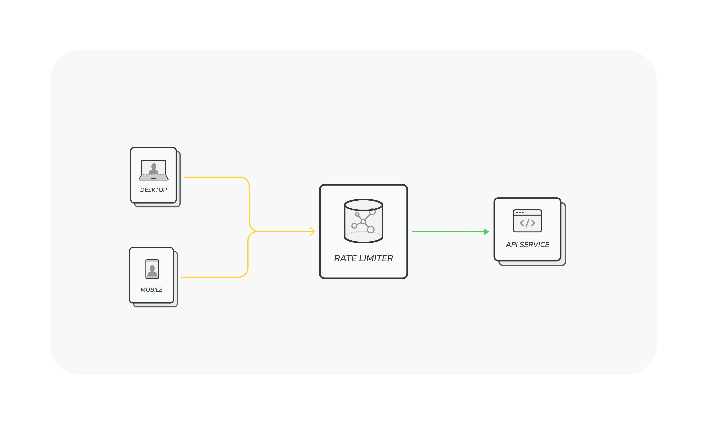
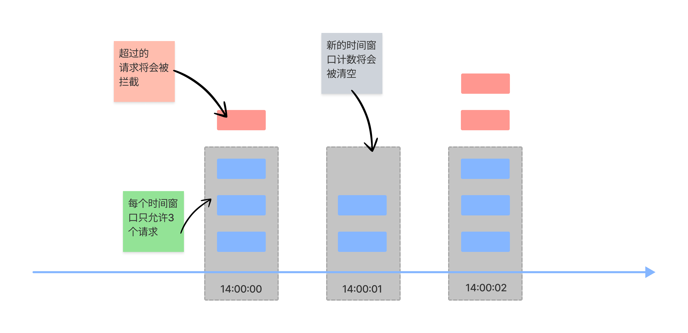
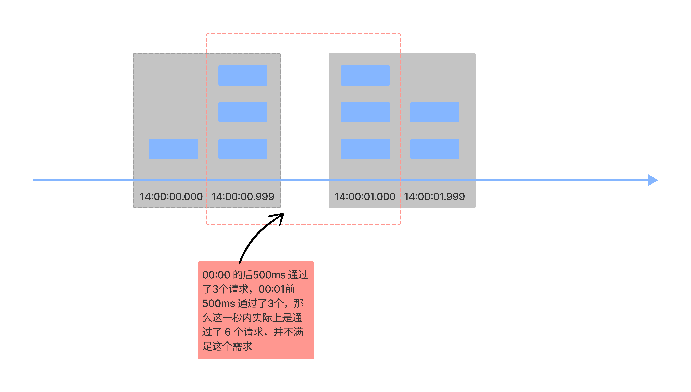
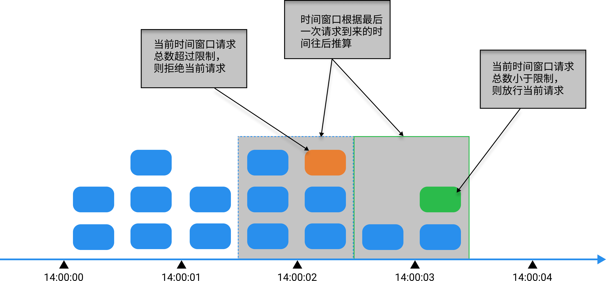
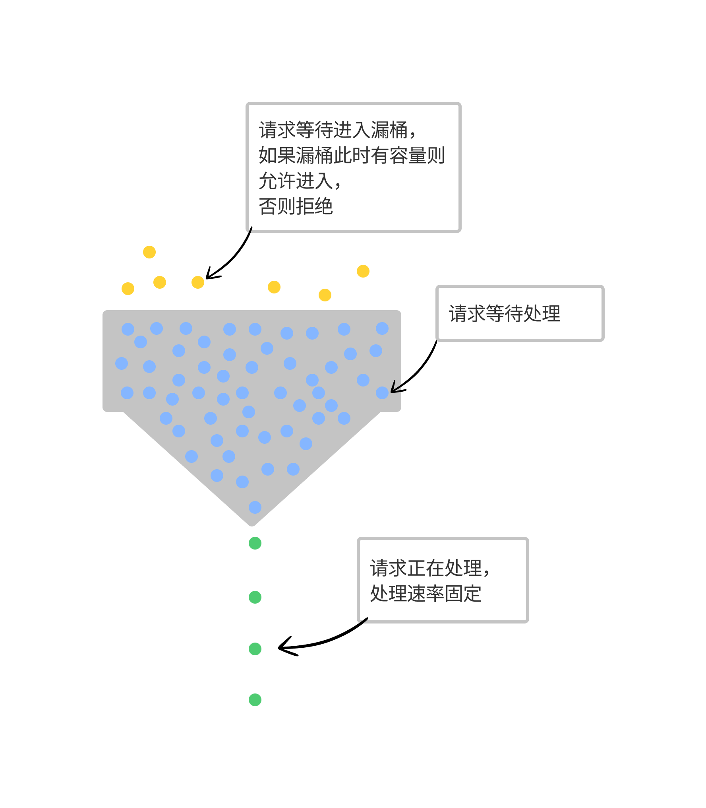
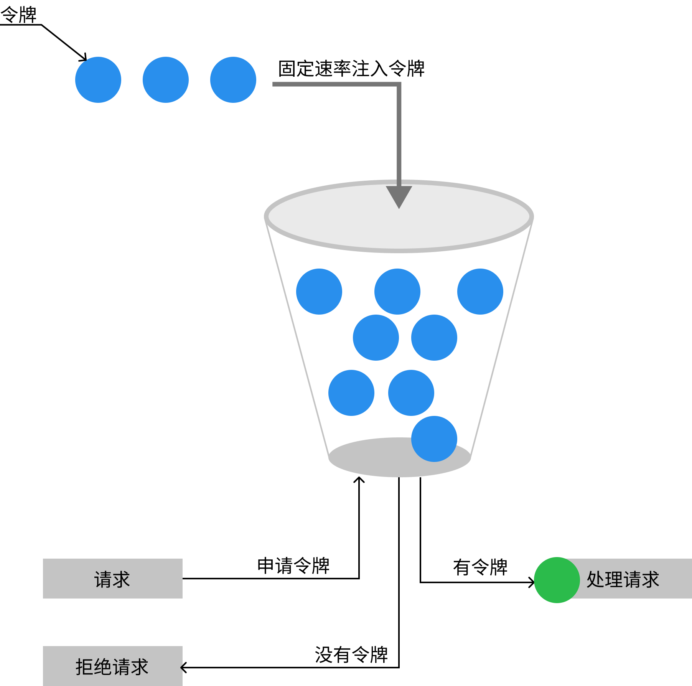

# 限流器设计

## 限流器的作用

限流器在软件系统中的作用主要是限制一定时间范围内一个对象（比如特定用户、IP、设备等）能够发出事件（访问、操作服务资源的时间）的个数，通俗点说就是限制一个对象在一定时间内的请求数量，超过此限制的请求将被拦截。

限流器的工作过程如上图所示，在请求到达服务之前，将会通过限流器的控制。

限流器的主要作用为

- 避免因为过量的请求将服务资源耗尽而影响服务
- 避免服务资源出现被 DOS（Denial of service）攻击的情况发生
- 避免因为某个别对象的过量请求导致服务器负担过重而影响整体用户的体验

## 限流算法

### 固定窗口计数法

实现步骤如下：

- 将时间按照设定的周期划分为多个窗口
- 在当前时间窗口内每来一次请求就将计数器加一
- 如果计数器超过了限制数量，则拒绝服务
- 当时间到达下一个窗口时，计数器的值重置

该算法优点是实现起来比较简单，只需要固定间隔重置计数器，然后每次请求执行前检查计数器是否达到最大值即可。

该算法的缺点就是无法准确确保限流是准确和完全符合业务需求的。假设现在的需求如下：

> 一个 IP 一秒内的请求数量不能超过5个

算法可能出现的问题如图所示，可能在一的时间窗口内最大通过限制数量2倍的请求。

该算法比较适合对限流敏感度不高的场景

### 滑动窗口计数法

该算法的实现步骤

- 将设定的时间周期设为滑动窗口的大小，记录每次请求的时刻
- 当有新的请求到来时将窗口滑到该请求来临的时刻
- 判断窗口内的请求数是否超过了限制，超过限制则拒绝服务，否则请求通过
- 丢弃滑动窗口以外的请求

该算法解决了固定窗口计数法的缺陷，但是实现起来比较复杂，涉及到实时统计和保存请求时间。

滑动窗口和固定窗口都**无法解决短时间之内集中流量的突击**，比如系统一秒内只能接收100个请求，有可能在前 200ms 内就已经达到了阈值，导致系统在后面 800ms 的时间内无法提供服务，请求流量处理不平滑。

> 这里的滑动窗口限流跟 TCP 中的滑动窗口是不同的概念，TCP 中为了解决传输效率的问题，引入了滑动窗口的概念，窗口大小就是指**无需等待确认应答，而可以继续发送数据的最大值**，这个窗口是接收端告诉发送端自己还有多少缓冲区可以接收数据。

### 漏桶算法

算法的实现过程如下：

- 将进来的请求流量视为水滴先放入桶内
- 水从桶的底部以固定的速率匀速流出，相当于在匀速处理请求
- 当漏桶内的水满时(超过了限流阈值)则拒绝服务

该算法可以将速率不定的请求转化为固定的速率来处理，这样请求的处理更加平滑，但是对一些场景来说，可能这种处理方式过于保守，如果瞬间涌入的流量在阈值范围内，那处理的时候还要按照固定速率来，会导致部分请求等待时间过长。

Nginx 中的 limit_req 模块的底层实现就是用的这种算法

### 令牌桶算法

算法的实现过程如下：

- 按照一定的速率生产令牌并放入令牌桶中
- 如果桶中令牌已满，则丢弃令牌
- 请求过来时先到桶中拿令牌，拿到令牌则放行通过，否则拒绝请求

